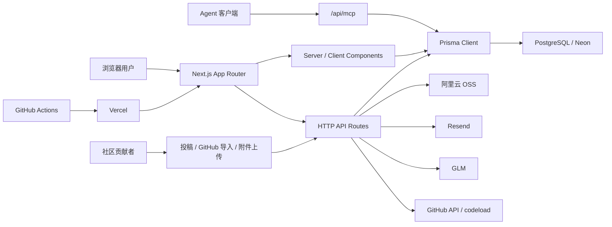
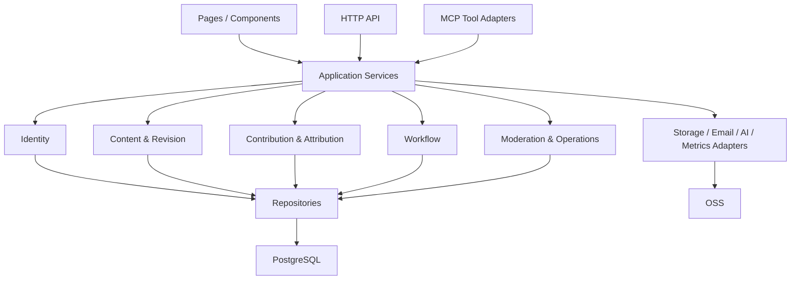

# N.E.I. Platform Architecture & Roadmap

> **For Claude / Codex / GLM:** implement this roadmap through small PRs. Read `AGENTS.md` first. Authentication, database migrations, MCP tokens, admin permissions, deployment and licensing require maintainer approval.

**Goal:** 把 `nei-pevc.com` 从功能齐全的 Public Beta 单体，整理成可持续维护的 PEVC 内容与 MCP 分发平台，并建立可被用户和贡献者理解的信任闭环。

**Architecture:** 保留 Next.js 模块化单体，不拆微服务。按 Identity、Content、Contribution、Workflow、MCP、Operations 六个领域划分应用服务；页面、HTTP API 和 MCP tools 共用同一组领域查询与规则。PostgreSQL 保存结构化事实，阿里云 OSS 保存用户附件，Git 仓库只保存代码和明确标记的官方静态内容。

**Tech Stack:** Next.js 15 App Router、React 18、TypeScript、Prisma 5、PostgreSQL / Neon、阿里云 OSS（S3-compatible）、MCP SDK、Vercel、GitHub Actions。

---

## 1. 审计范围与证据

审计日期：2026-07-10。

本轮只读检查了：

- 正确仓库：`D:\02-Dev\12. nei-pevc-lensnowovo`
- GitHub 主仓库：`lensnowovo/N.E.I.-The-World-of-Financial-Evolution`
- 生产站：`https://nei-pevc.com`
- 25 个页面入口、44 个 API route、14 个 Prisma model
- 172 个 TypeScript / TSX 文件，约 24,111 行应用代码
- 首页、Skill 详情、游客 MCP 连接、MCP / API 库、投稿登录跳转和移动端首页
- 认证、会话、投稿、附件、公开 API、MCP、Admin、指标、CI 和 Vercel 构建路径

生产抽样结果：

- 首页：HTTP 200，抽样 TTFB 约 0.27 秒，HTML 约 230 KB
- Skill #42：HTTP 200，抽样 TTFB 约 0.26 秒
- MCP / API 库：HTTP 200，抽样 TTFB 约 0.52 秒，HTML 约 217 KB
- 67 个公开 Skill 详情 smoke 全部通过
- 附件 #77-#80 未进入 Git 静态缓存，但在线均可从对象存储成功下载
- `npm run verify` 在提供 CI 占位环境变量后通过
- `npm run build` 完成编译和类型检查，因构建期 sitemap 连接本地不可达的 Neon 而失败
- `npm audit --omit=dev` 报告 2 个 moderate（Next.js 内嵌 PostCSS）；当前没有安全的自动修复路径，不应运行 `npm audit fix --force`

证据限制：本轮没有使用管理员登录态，没有读取 Vercel 生产环境变量，也没有验证 Neon 备份、OSS 生命周期和告警渠道。因此 Admin 真实错误率、备份 RPO/RTO 和生产密钥轮换不在已验证范围内。

## 2. 总体判断

N.E.I. 已经是一套可用的 Public Beta 产品，不再是简单 Prompt 展示站。它同时承担：

1. PEVC Skill / Prompt / Workflow 内容库；
2. 投稿、附件、收藏、评论和贡献者主页；
3. MCP Token、全库搜索、收藏库和外部连接器分发；
4. 内容审核、MCP 准入、精选和错误监控；
5. 公开 API 与搜索引擎入口。

当前技术选型足够支撑未来 6-12 个月。最值得保留的是 Next.js + PostgreSQL + OSS 的模块化单体组合。当前社区规模和内容规模不需要微服务、Kafka、独立搜索集群或 Kubernetes。

主要矛盾已经从“功能缺不缺”转向四件事：

- 业务规则散落在页面、API 和 MCP route 中，修改成本开始上升；
- 内容、贡献者、工作流和 MCP 调用还没有形成统一的数据闭环；
- 自动审核、真实连接状态和观测数据存在可信度缺口；
- CI 能检查语法，但还不能证明生产构建和关键用户流程可用。

## 3. 当前架构



优点：

- App Router、TypeScript strict、Prisma 和统一 npm lockfile，基础清楚；
- 管理 API 使用服务端 `requireAdmin`，没有依赖前端隐藏按钮；
- 投稿正文进入数据库前执行 HTML 清洗；
- MCP Token 只存 SHA-256 hash，编辑 Skill 会撤销 MCP 准入；
- MCP 内容有 `mcpApproved`、版本、审核和安全前缀等多层边界；
- OSS、数据库和本地文件已有统一 storage abstraction；
- branch protection、PR CI、线上 smoke 和 Admin 指标已有雏形。

结构性问题：

- `app/publish/PublishForm.tsx` 约 1180 行；
- `app/api/mcp/route.ts` 约 939 行，注册 14 个 tools；
- `app/posts/[id]/page.tsx` 约 775 行；
- 页面和 route 直接调用 Prisma，缺少稳定的 application service 边界；
- Web 搜索、公开 API 和 MCP 搜索存在重复规则，后续容易产生结果漂移；
- Workflow 与 MCP Library 是 TypeScript 常量，Skill 是数据库内容，运营数据分成两套来源。

## 4. 数据模型审计

现有模型覆盖 User、Post、SkillAsset、Attachment、Favorite、Comment、Report、MCP Log、MetricSample 和 Consent，Beta 阶段已经够用。

需要优先修正的语义：

1. `PostFavorite` 同时承担 Star 和收藏，Profile 却展示两个内容相同的 tab；产品概念重复。
2. `mcpReadyCount` 当前按 `skillAsset isNot null` 统计，没有按 `mcpApproved = true` 统计，贡献者徽章可能失真。
3. `tagContent` 存为 JSON string，搜索时最多先取 500 条再在 Node 内过滤、排序和分页。内容继续增长后，结果会被截断。
4. `status`、`securityLevel`、`assetType` 使用任意字符串，数据库无法阻止非法状态。
5. `commentCount`、`likeCount`、`viewCount` 等计数采用多种策略，存在漂移和重复计数风险。
6. `UserConsent` 已建表但代码没有写入；目前页面展示了协议，数据库并没有形成确认记录。
7. `apiKeyEnc` 和 `lib/crypto.ts` 属于已下线站内执行功能的遗留代码，应在确认无生产依赖后清理。
8. `Attachment.storageKey` 看不出对象来自 static cache、OSS、database fallback 还是 local，导致 smoke 无法判断正确来源。

中期推荐新增，而非立即重命名或重构全部 Post：

- `ContentRevision`：正文、版本、审核结论、发布人和发布时间；
- `ContributionAttribution`：原作者、贡献者、整理者、授权方式和来源 URL；
- `Workflow` / `WorkflowStep`：把 Bundle 从 TypeScript 常量变成可运营实体；
- `McpToken`：支持每客户端一个 Token、名称、hash、生成时间、撤销时间、最后调用和 scope；
- `ContributionEvent`：精选、进入 Workflow、MCP 准入、被收藏和被调用等可展示事实；
- `Attachment.storageBackend`：`static | oss | database | local`。

## 5. 关键风险

### P0：下一轮必须处理

#### P0-1 自动审核失败时放行公开内容

`POST /api/posts` 在 GLM 未配置、超时或解析失败时把 verdict 保持为 `safe`，并直接公开。它不会自动进入 MCP，但会削弱公开内容和贡献者体系的信任。

建议：审核异常时写入 `unreviewed` / `pending`，Admin 自有导入可以通过明确的管理员通道发布。不得把“扫描没有结果”记录成“安全通过”。

#### P0-2 构建依赖生产数据库

`app/sitemap.ts` 在静态生成阶段访问 Neon。CI 没有数据库，因此 `build` 没进入 required check；本地网络连不上 Neon 时也无法完成构建。

建议：sitemap 运行时生成并设置合理缓存，或构建失败时至少返回静态路由；GitHub Actions 增加 PostgreSQL service 和真实 `npm run build`。

#### P0-3 发布阶段执行 `prisma db push`

Vercel build command 当前是 `prisma db push --skip-generate`。它绕过 migration history，把 schema 变更和前端部署绑在同一不可审查步骤中。

建议：只使用已提交 migration，部署执行 `prisma migrate deploy`；高风险 migration 采用 expand / migrate / contract 三步。

#### P0-4 MCP “已连接”状态不对应当前 Token

生成新 Token 时没有清空 `tokenLastUsedAt`，`isConnected` 又按用户历史任意 `McpCallLog` 判断。旧 Token 曾经调用过后，新 Token 即使没有配置也可能显示已调通。MCP 日志还是 fire-and-forget，Vercel 可能在写入完成前结束函数。

建议：短期生成/撤销 Token 时清空当前连接状态，并可靠写入首次成功调用；中期改为独立 `McpToken` model，连接状态绑定 token id / generation。

#### P0-5 没有自动化测试层

仓库没有单元测试、API 集成测试或 Playwright E2E。当前 CI 只能证明 schema、lint 和类型通过。

建议第一批只覆盖六条高价值路径：注册验证码、帖子权限、附件归属、Admin 审核、MCP token 隔离、编辑后撤销 MCP 准入。

#### P0-6 贡献者授权与署名规则不够完整

GitHub 仓库公开但没有 LICENSE；代码贡献、网站内容、转载内容的授权语义没有被分开。对于“贡献者信任体系”，这是产品问题，也是协作治理问题。

建议由维护者确认：代码许可证、内容许可证/投稿授权、转载与原创的署名规则、撤回/更正机制。界面应明确展示“原作者、贡献者、收录整理、N.E.I. 状态和 Workflow 收录”。

### P1：1-2 个月内处理

- 把 MCP tools、投稿导入和详情页拆成领域模块；
- 将搜索、标签过滤、热门排序迁入 PostgreSQL，去掉 500 条内存上限；
- 区分公开可缓存数据和登录用户状态，避免首页因 cookie 查询全站 `no-store`；
- 为 MCP、公开 API、AI 转写和上传增加跨实例限流；
- 收紧 CSP 中的 `unsafe-eval`、`unsafe-inline` 和宽泛 `connect-src https:`；
- MetricSample 增加保留期，降低对业务请求的同步写入成本；
- 上传增加文件签名检查、孤儿附件清理和明确 storage backend；
- Profile 合并重复的 Star / 收藏概念，修正 MCP Ready 指标；
- Connect 游客页不要发起两个预期 401 请求；
- 补 favicon、结构化错误页和实际可执行的发布检查清单。

### P2：需求出现后处理

- 团队私有 Skill Library、Organization、成员角色和团队 Token；
- 向量检索或独立搜索服务；
- 异步队列、Outbox 和独立 worker；
- 多区域数据库、独立 MCP 服务、微服务；
- 在线执行 Skill、代用户支付模型 Token；
- Marketplace、付费分成和复杂贡献者等级。

## 6. 产品体验审计

### 首页

健康度：良好。

- 价值主张、任务入口、MCP 入口和 Skill Library 都能被看见；
- 390px 移动端没有横向溢出，菜单、搜索和 CTA 可用；
- 页面全高约 5,500px（桌面）/ 9,800px（移动端），首次访问者需要在任务入口、MCP CTA、筛选和大量卡片之间持续滚动；
- 首页与 API 都是 `no-cache`，每次访问都触发数据库查询。

建议：首页首屏继续保留；24 张首批卡片可以减到 12-16 张，并把“精选、热门、最新”做成明确视图。贡献者信任入口放在卡片和详情来源模块，不再新增一整块长首页模块。

### Skill 详情

健康度：可用，信息偏重。

- 标题、简介、复制、使用摘要、正文、作者、来源、质量和评论形成完整信息链；
- 详情页很长，Usage Brief、右栏元信息和 Quality & Source 有部分重复；
- 贡献者、原作者、收录者和授权说明没有形成一个统一模块。

建议：把“作者 / 来源 / N.E.I. 状态 / Workflow 收录 / 授权”合并成 Contribution & Provenance 卡；质量模块继续保留，避免与 Usage Brief 重复。

### MCP onboarding

健康度：文案清楚，状态模型需要修正。

- 游客态不再停留在“加载中”；
- 明确说明不读取本地文件、不上传项目材料；
- 连接页游客态会请求两个登录 API，浏览器控制台出现预期 401；
- 当前绿灯代表用户历史上曾调用过 MCP，不能严格证明当前 Token 已配置。

### MCP / API 库

健康度：内容丰富，浏览成本高。

- 连接器与 Skill 的视觉形式已经区分；
- 页面约 8,300px 高，分类内条目采用完整详情卡，扫描和比较成本高；
- 数据全部硬编码在 `lib/mcp-library.ts`，运营更新必须发代码版本。

建议：默认展示紧凑目录行，点击展开详情；增加搜索、场景、数据类型、成本、授权和成熟度过滤。中期迁入数据库或可审核的内容文件，不必立即做复杂 CMS。

## 7. 目标架构



目录建议（逐步迁移，不做一次性搬家）：

```text
modules/
  identity/
    service.ts
    repository.ts
    schemas.ts
  content/
    queries.ts
    commands.ts
    quality.ts
    moderation.ts
  contribution/
    attribution.ts
    impact.ts
  workflow/
    queries.ts
  mcp/
    auth.ts
    registry.ts
    tools/
  operations/
    metrics.ts
    review.ts
infrastructure/
  db/
  storage/
  email/
  ai/
```

迁移原则：新功能先进入 modules；旧页面逐个调用新 service；不要为了目录整齐同时重写全部路由。

## 8. 核心产品闭环

N.E.I. 下一阶段的护城河应由同一条可验证链路产生：

```text
贡献者投稿
  → 署名与授权被记录
  → 安全/质量审核
  → 进入公开库、精选或 Workflow
  → 用户在网页或 MCP 发现
  → 收藏、调用、反馈形成影响数据
  → 贡献者看到真实复用结果
  → 内容迭代产生新版本
```

这条链路同时解释产品、数据模型和社区治理。增加 Skill 数量仍有价值，但内容数量不再是单独 KPI。更应该关注：

- 有多少内容带有可验证来源和授权；
- 有多少内容达到 MCP Ready；
- 有多少 Workflow 被真实调用；
- 有多少贡献者获得收藏、收录和复用；
- 内容被编辑后能否保留版本与审核轨迹。

## 9. 分阶段路线图

### 阶段 A：可信 Beta（0-2 周）

目标：让发布、连接、贡献和部署结果可信。

1. 修复 MCP 当前 Token 的真实连接状态；
2. 自动审核异常改为 pending / unreviewed；
3. 让 CI 能运行 build，并停止部署期 `db push`；
4. 修正附件 smoke，区分 static 与 OSS；
5. 修正 Profile 的 MCP Ready 统计和重复 Star / 收藏；
6. 上线 Contribution & Provenance 来源卡；
7. 确认代码与内容授权政策；
8. 加入第一批 API / 权限测试。

### 阶段 B：贡献者信任体系 v1（3-8 周）

目标：贡献者能看见自己的署名、状态和影响。

1. 详情页展示原作者、贡献者、整理者、授权和 Workflow 收录；
2. Profile 展示公开数、精选数、MCP Ready 数、被收藏数和 Workflow 收录；
3. 徽章只由真实行为产生；
4. 增加更正、撤回和来源争议入口；
5. Admin 能查看来源完整性和授权状态；
6. 建立 ContentRevision 与审核记录。

### 阶段 C：Workflow 与分发底座（2-4 个月）

目标：从单条内容库升级为可组合、可版本化的工作方法库。

1. Workflow / WorkflowStep 数据化；
2. Web、公开 API、MCP 共用 Content Query Service；
3. PostgreSQL 搜索、过滤、排序和 cursor pagination；
4. 每客户端 MCP Token、scope、撤销和调用审计；
5. MCP tools 按领域拆分并增加契约测试；
6. 公开内容缓存与用户状态分离；
7. Admin 运营指标从“请求数”升级到“发现 → 收藏 → 调用 → 复用”。

### 阶段 D：团队产品验证（4-12 个月）

只在 3-5 家真实机构提出同类需求后启动：

1. Organization 与团队私有库；
2. 团队成员角色与审计日志；
3. 私有 Workflow / MCP Token；
4. 数据保留、导出、删除和机构合规；
5. 商业化与 SLA。

## 10. 首批 10 个开发任务

### Task 1: 可信发布状态

**Why:** 审核系统失败时不能把未知状态标成 safe。

**Files:** `app/api/posts/route.ts`、`lib/ai.ts`、`app/admin/page.tsx`、`app/admin/AdminConsoleClient.tsx`、`prisma/schema.prisma`。

**Acceptance:** GLM 超时/未配置时社区投稿进入待审；管理员导入有明确且可审计的发布路径；异常不会显示“安全通过”。

**Complexity:** M

### Task 2: MCP Token 真实连接状态

**Why:** 绿灯必须对应当前 Token，而不是用户历史任意调用。

**Files:** `app/api/users/me/mcp-token/route.ts`、`app/api/users/me/mcp-status/route.ts`、`app/api/mcp/route.ts`、`components/home/HomeMcpFeature.tsx`、`components/mcp/McpOnboardingChecklist.tsx`。

**Acceptance:** 重新生成 Token 后状态回到“待调通”；新 Token 第一次成功调用后转为已连接；撤销后不显示已连接；日志写入失败不会产生假绿灯。

**Complexity:** M

### Task 3: 可复现构建与 migration 发布

**Why:** PR 必须证明生产 artifact 能构建，部署不应隐式改 schema。

**Files:** `app/sitemap.ts`、`package.json`、`vercel.json`、`.github/workflows/ci.yml`、`prisma/migrations/`、`docs/DEPLOY.md`。

**Acceptance:** 无生产数据库连接也可完成构建，或 CI PostgreSQL 可稳定构建；Vercel 不再执行 `prisma db push`；migration 失败会阻止发布。

**Complexity:** M

### Task 4: 第一批后端契约测试

**Why:** 当前 44 个 API route 没有自动化行为测试。

**Files:** `package.json`、`tests/`、`.github/workflows/ci.yml`，以及对应 route/service。

**Acceptance:** 注册码、帖子越权、附件归属、Admin 审核、MCP 用户隔离、编辑撤销准入均有自动化测试；CI required check 执行测试。

**Complexity:** L

### Task 5: Contribution & Provenance 卡

**Why:** 署名与来源是贡献者信任体系的第一触点。

**Files:** `app/posts/[id]/page.tsx`、`components/` 新来源组件、`lib/bundles.ts`、`app/contribution-guidelines/page.tsx`。

**Acceptance:** 原创、转载和官方收录能分别展示贡献者、原作者、整理者、来源、精选/MCP 状态、Workflow 收录和授权说明。

**Complexity:** M

### Task 6: 贡献者主页指标纠偏

**Why:** 公开身份必须基于真实数据。

**Files:** `app/profile/[id]/page.tsx`、`lib/bundles.ts` 或新的 contribution query。

**Acceptance:** MCP Ready 只统计 `mcpApproved=true`；Star / 收藏不重复；展示被收藏、精选和 Workflow 收录；徽章规则有测试。

**Complexity:** M

### Task 7: MCP route 模块化

**Why:** 939 行单文件让 14 个 tools 共用隐式状态，审核和回归范围过大。

**Files:** `app/api/mcp/route.ts`、新建 `modules/mcp/registry.ts`、`modules/mcp/auth.ts`、`modules/mcp/tools/*.ts`。

**Acceptance:** route 只负责 transport、auth 和 tool registry；每个 tool 有独立 schema/handler/test；搜索与推荐调用 content service。

**Complexity:** L

### Task 8: 搜索与标签数据化

**Why:** Node 内存排序和 500 条上限会产生不完整结果。

**Files:** `lib/feed.ts`、`prisma/schema.prisma`、migration、`app/api/v1/skills/route.ts`、MCP search tool。

**Acceptance:** PostgreSQL 完成过滤、排序和分页；Web / API / MCP 对同一查询返回一致顺序；1 万条内容下仍能稳定分页。

**Complexity:** L

### Task 9: 附件来源与生命周期

**Why:** 当前 smoke 把正常 OSS 用户附件报成 Git 静态文件缺失。

**Files:** `prisma/schema.prisma`、`lib/storage.ts`、`scripts/smoke-public-downloads.ts`、`app/api/upload/route.ts`、定时清理 route/script。

**Acceptance:** 每个附件明确 storage backend；静态内容检查 Git 文件，OSS 内容检查对象可读；24 小时未关联附件可清理；上传验证扩展名与文件签名。

**Complexity:** M

### Task 10: 公开内容缓存边界

**Why:** 首页和公开 API 当前均不命中 Vercel cache。

**Files:** `app/page.tsx`、`app/posts/[id]/page.tsx`、`lib/feed.ts`、`app/api/v1/*`、用户状态 client components。

**Acceptance:** 公开内容可使用 revalidate/tag cache；Star、MCP 和登录状态单独加载；发布/编辑/审核能精准失效缓存；匿名首页不必每次读取 session 和全部内容。

**Complexity:** L

## 11. 建议记录的 ADR

1. **ADR-001：继续使用模块化单体。** 当前规模下部署简单、事务一致、运营成本低；拒绝提前拆微服务。
2. **ADR-002：PostgreSQL 管结构化事实，OSS 管用户二进制。** Git 只保存官方静态内容，不承载社区上传仓库。
3. **ADR-003：内容采用不可变 Revision。** 修改生成新版本，审核与 MCP 准入绑定具体版本。
4. **ADR-004：Web / API / MCP 共用 application service。** transport 可以不同，内容可见性和排序规则只能有一个来源。
5. **ADR-005：贡献者影响只展示可验证事件。** 精选、收录、收藏和调用来自系统事实，不使用人工夸张等级。
6. **ADR-006：先用 PostgreSQL 搜索。** 达到实际瓶颈后再评估向量库或搜索服务。

## 12. 不建议现在做的事

- 不重写为微服务；
- 不把数据库从 PostgreSQL 换走；
- 不做站内模型执行和统一 Token 付费；
- 不用向量数据库替代基本的结构化搜索；
- 不在贡献者信任体系尚未建立前做内容交易市场；
- 不一次性升级 Next 16、React 19、Prisma 7 并同时重构业务；
- 不运行 `npm audit fix --force`，它会选择不合理的破坏性依赖版本。

依赖升级建议单独开兼容性 PR：先升级当前 major 内的安全补丁，再为 Next/React 和 Prisma major 分成两个阶段验证。

## 13. 成功标准

未来一个季度，N.E.I. 的进展不应只看 Skill 总数。建议使用：

- 公开内容中来源和署名完整率 ≥ 95%；
- MCP Ready 内容占公开内容 ≥ 60%，且均绑定已审核版本；
- MCP 新 Token 首次成功连接率和中位调通时间可观测；
- 关键 API / 权限规则自动化覆盖率 100%；
- PR required checks 包含 build + tests；
- 社区贡献内容被精选、进入 Workflow 或产生收藏/调用的比例持续提升；
- 首页、详情、MCP 搜索对同一内容的可见性与状态一致。

最终产品定位可以浓缩为一句话：

> N.E.I. 把一级市场从业者验证过的工作方法，沉淀成有来源、有版本、可组合、可通过 MCP 调用的公共资产。
